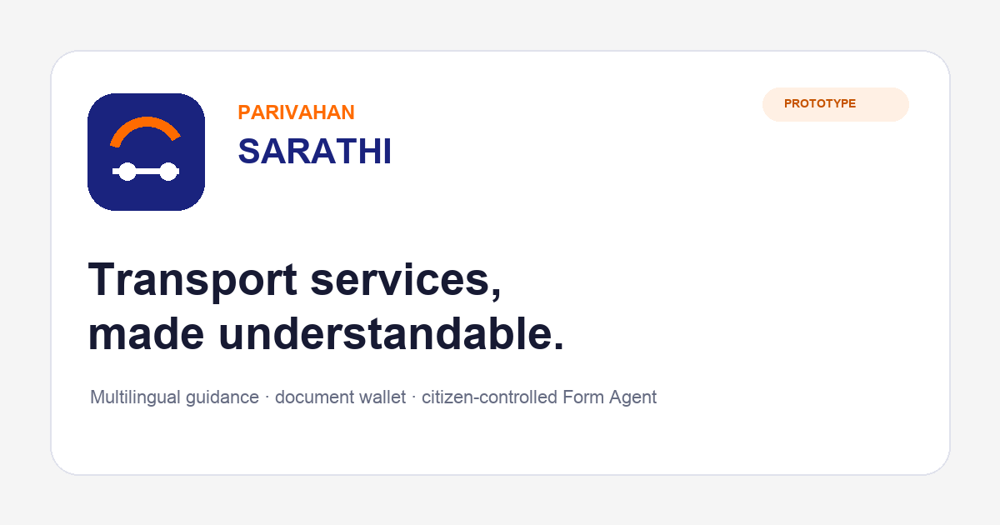

# Parivahan Sarathi

> A mobile-first transport guardian that turns fragmented portal journeys into one clear next action.

[**Open the live app**](https://paarivaahan.vercel.app/?build=20260828-53#home) · [**Replay onboarding**](https://paarivaahan.vercel.app/?demo=onboarding&build=20260828-53#home) · [**60-second Judge Mode**](https://paarivaahan.vercel.app/?judge=1&build=20260828-53#home)



Parivahan Sarathi is an independent **Build What Moves India** hackathon prototype. It helps a citizen understand deadlines, documents, forms and official handoffs across transport services—without pretending to replace government portals.

## Why it matters

A government service being online does not guarantee that a citizen knows:

- what requires attention now;
- which document or form is needed;
- where the official journey continues; or
- whether a payment or application actually completed.

Sarathi places urgency before navigation and explains the next step in plain language.

## What to try

| Journey | What it demonstrates |
|---|---|
| **Guest access** | Pay a challan, read a document, explore services or ask for guidance without signing in. |
| **Driving-licence renewal** | A prioritised deadline, four plain-language steps, source metadata and an official handoff. |
| **Document wallet** | Multi-vehicle records, attention filtering, offline snapshots and deliberate sharing. |
| **Challan payment** | Optional login, controlled automation, explicit failure recovery and a synthetic receipt. |
| **Form Agent** | Reviewable IDP form preparation while CAPTCHA, OTP, declarations, payment and submission remain with the citizen. |
| **English and Hindi** | Interface-level language switching on desktop and mobile. |

## Responsible prototype boundary

The build uses synthetic citizen data and deterministic demonstrations. It does **not** access government records, process real payments, submit applications or request OTPs. Production would require approved APIs, explicit consent, identity controls, security review and receipt reconciliation.

> **AI prepares; the citizen authorises.**

## Run locally

No dependency installation or build step is required.

```bash
python3 -m http.server 8765
```

Open `http://localhost:8765/?demo=onboarding#home`.

To run the regression checks with Node.js 18 or newer:

```bash
npm test
```

## Repository map

```text
.
├── index.html              # Application shell and accessible UI
├── app.js                  # State, routing, flows and validation
├── styles.css              # Responsive design system
├── sw.js                   # Offline application shell
├── assets/                 # Brand and vehicle imagery
├── tests/                  # Dependency-free regression checks
├── tools/                  # Reproducible asset/document utilities
└── docs/                   # Product, research, architecture and evidence
```

Start with the [documentation index](docs/README.md), or jump directly to:

- [Product requirements](docs/PRD.md)
- [Research and evidence](docs/RESEARCH.md)
- [Architecture](docs/ARCHITECTURE.md)
- [Architecture Decision Records](docs/adr/README.md)
- [End-to-end test report](docs/TEST_REPORT.md)
- [Reviewer guide](docs/JUDGE-GUIDE.md)
- [Visual design case study](docs/case-study/parivahan-sarathi-design-case-study.pdf)

## Technology

- Vanilla HTML, CSS and JavaScript
- Hash-based single-page routing
- Local browser persistence for non-sensitive demo state
- Service-worker shell caching
- Responsive desktop and mobile navigation
- Dependency-free Node.js smoke tests

## Status

Build **20260828-53** is live on Vercel and linked to the GitHub `main` branch. The application, documentation and evaluation evidence use the same tested source state.

## Disclaimer

Parivahan Sarathi is an independent hackathon prototype. It is not affiliated with or endorsed by the Government of India, MoRTH or Parivahan.

Released under the [MIT License](LICENSE).
